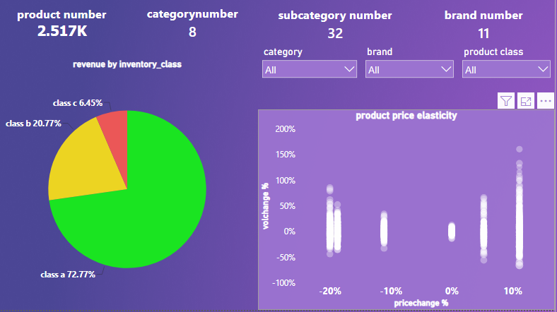

# product_analysis_on_contoso_data_set
# produt Sales & Elasticity Analytics Dashboard

## 📊 Overview
هذه الداشبورد تم تصميمها لتحليل أداء الأصناف وقياس مرونة الطلب (Price Elasticity) لاتخاذ قرارات تسعير استراتيجية.

## 📸 Dashboard Preview
*

## 🚀 Key Features
- **Price Elasticity Analysis:** تحليل الحساسية السعرية للأصناف.
- **Inventory Classification:** تصنيف ABC للمخزون.
- **Interactive Filtering:** إمكانية الفلترة حسب الفئة والماركة.

## 🛠 Tools Used
- **Power BI** | **DAX** | **Data Modeling**
